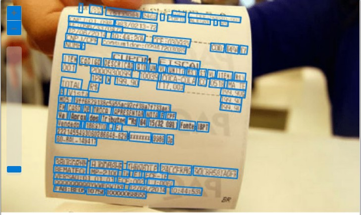
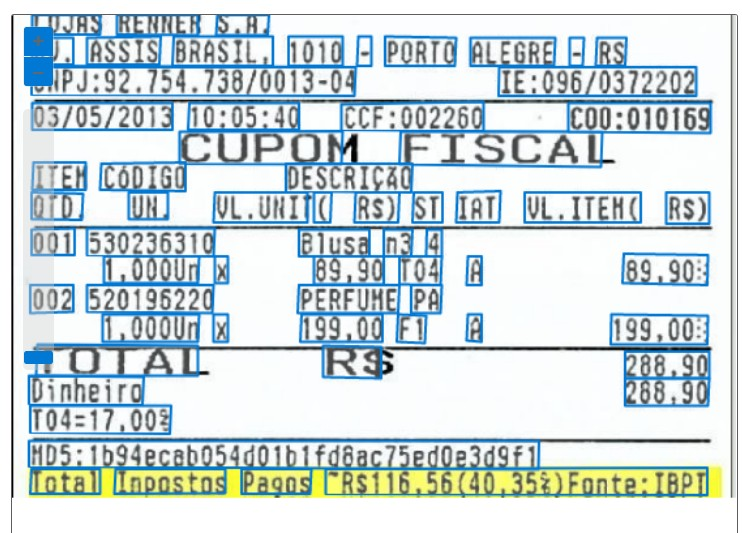

# README (dio-lab-visaocomp)
Repositório criado para atender o ítem Trabalhando com Visão Computacional.

# PASSO A PASSO DO TRABALHO
* Foi realizado a extracao de alguns cupons fiscais na internet para servirem de exemplo;
* As imagens foram submetidas ao Reconhecimento Optico de Caracteres do servico da Azure - Vision Studio - Extract text from images;
* Estas imagens quando submetidas ao servico de extracao de texto, poderam ser utilizados para alimentar um banco de dados para posterior utilizacao de alguma aplicacao;
  

## Screenshots

