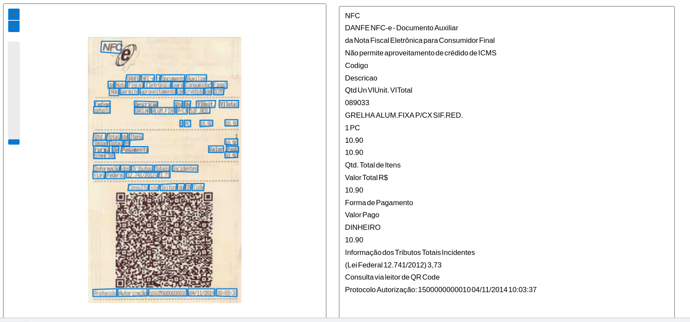

# README (dio-lab-visaocomp)
Repositório criado para atender o ítem Trabalhando com Visão Computacional.

# PASSO A PASSO DO TRABALHO
* Foi realizado a extracao de alguns cupons fiscais na internet para servirem de exemplo;
* As imagens foram submetidas ao Reconhecimento Optico de Caracteres do servico da Azure - Vision Studio - Extract text from images;
* Estas imagens quando submetidas ao servico de extracao de texto, poderao ser utilizadas para alimentar um banco de dados para posterior utilizacao de alguma aplicacao;
* Para fazer a extracao do texto primeiramente entramos no portal: [AZURE - Vision Studio - Extract text from images](https://portal.vision.cognitive.azure.com/demo/extract-text-from-images)
* Selecionamos o arquivo ao qual desejamos extrair o texto;
* A figura e carregada na tela mostrando sua marcacao de reconhecimento de texto, e logo ao lado, o conteudo encontrado pela IA da Azure;
* Nos Screenshots pode-se verificar alguns exemplos de como o cupom fiscal fica demarcado  pela  IA;
* Entao tem-se como resultado final a janela ao lado da figura com todo o conteudo extraido da figura 3.

## Screenshots

